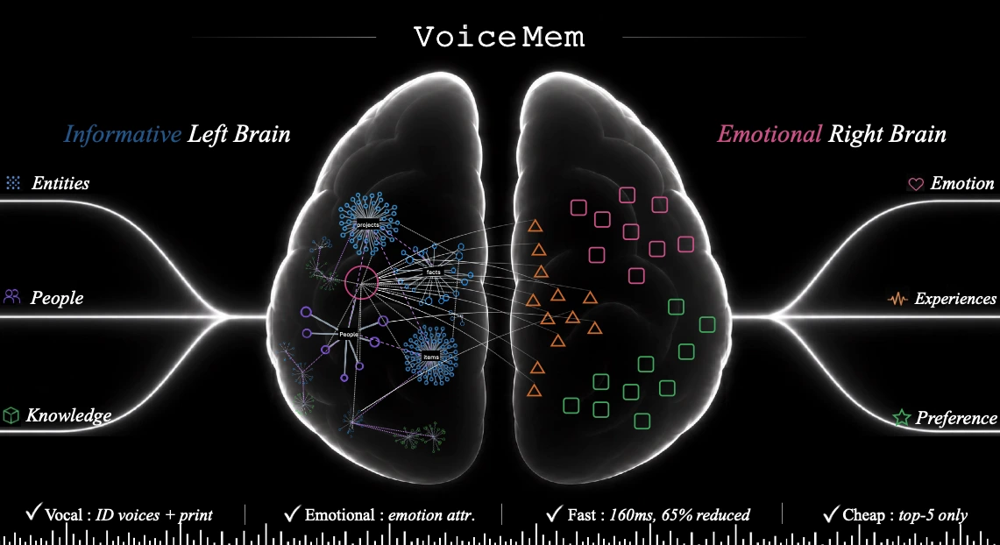
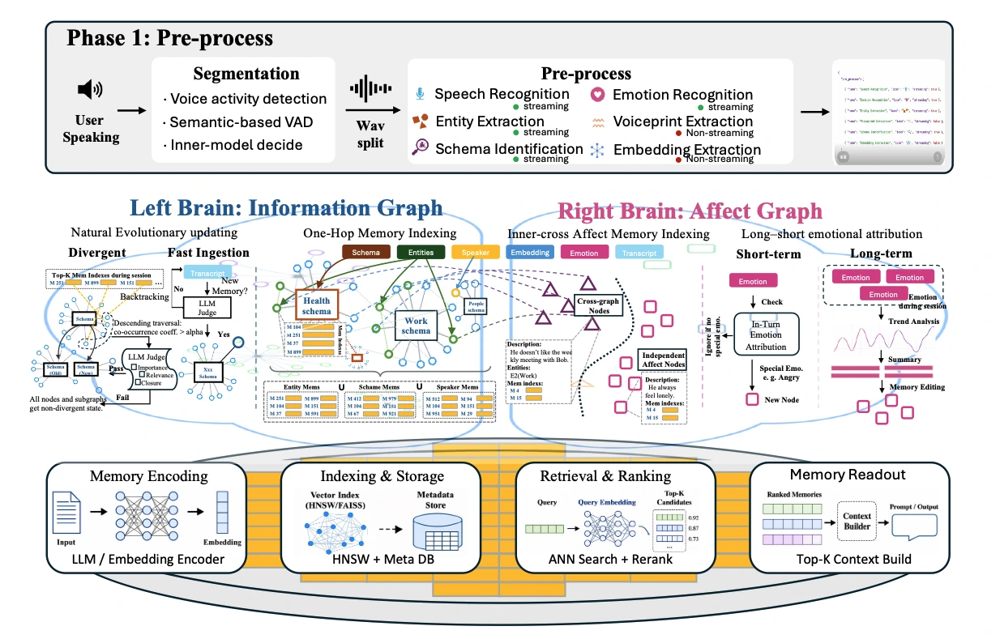
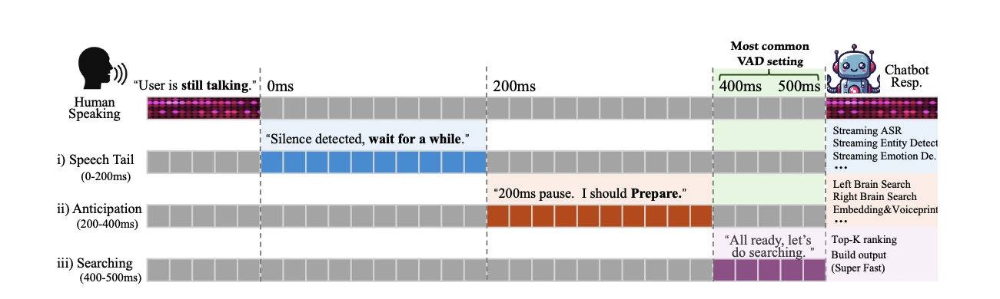
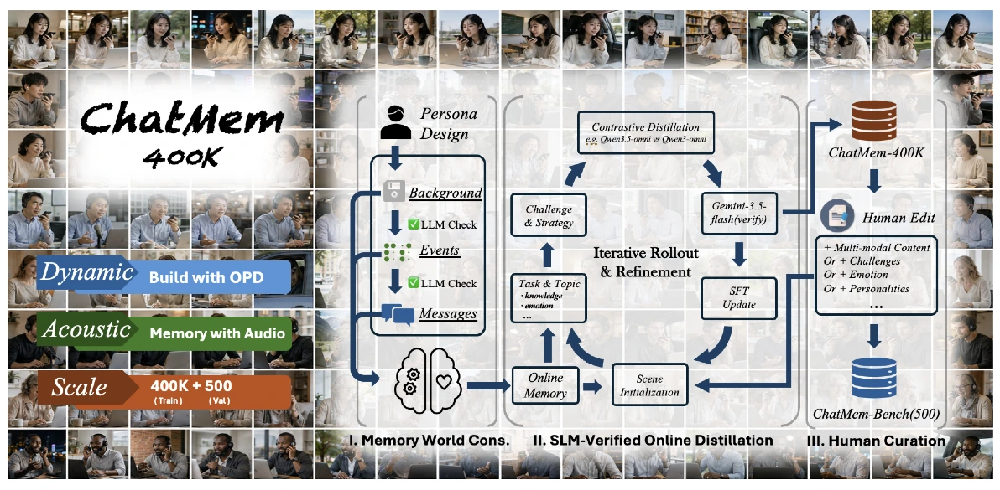
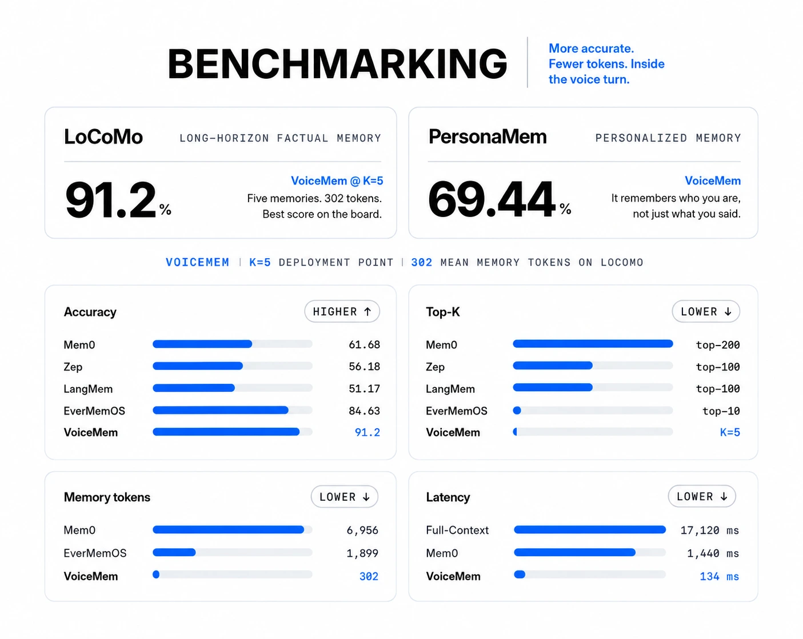

<a id="chinese"></a>

<p align="center">
  
</p>

<p align="center">
  <strong>中文</strong> | <a href="#english">English</a>
</p>

<p align="center">
  <a href="https://xzf-thu.github.io/VoiceMem/">项目主页 🌐</a> /
  <a href="https://arxiv.org/abs/2605.19833">技术报告 📖</a> /
  <a href="https://huggingface.co/zhifeixie/VoiceMem_Default_Models_Env">VoiceMem Utils 🤗</a> /
  <a href="https://huggingface.co/zhifeixie/VoiceMem_MF_Qwen3_6_35B_A3B_Qlora">VoiceMem Model Families 🤗</a> /
  <a href="https://huggingface.co/datasets/zhifeixie/VoiceMem-ChatMem400k">ChatMem-400K 🤗</a>
</p>

<p align="center">
  <a href="wechat.jpg">
    
  </a>
  <a href="https://x.com/XieZhifei14110">
    
  </a>
  <a href="https://xzf-thu.github.io">
    
  </a>
</p>

<p align="center">
  
</p>

---

我们带来 **VoiceMem**，为语音模型增加最后一个组件：灵魂，让它真正越来越懂你。VoiceMem 建立在<strong>「流式双脑」</strong>架构之上，提供**精准、有情感、懂人格、低延迟且最便宜的记忆服务**。本仓库将<strong>「永久保持全部开源」</strong>。

快速理解 VoiceMem：

* **左脑：** 直接管理信息，在 Top-3 限制下维持 Mem0 的满载性能。
* **右脑：** 用长短期情绪归因管理「情商」，含交叉节点、与左脑信息联合维护。
* **低延迟：** 通过压缩信息、分层存储、流式查询（0–300 ms 投机预取），几乎不增加延迟。
* **简单实用：** 单轮查询约 300 token；架构全部解耦，全部组件（含底层记忆引擎）都可更换。

<p align="center">
  
</p>

## 🎬 Demo

> **注意：** 播放前需要先取消静音。
https://private-user-images.githubusercontent.com/201621992/641678899-162f6655-caa7-4e5d-9dd4-bc6546c4b43b.mov?jwt=eyJ0eXAiOiJKV1QiLCJhbGciOiJIUzI1NiJ9.eyJpc3MiOiJnaXRodWIuY29tIiwiYXVkIjoicmF3LmdpdGh1YnVzZXJjb250ZW50LmNvbSIsImtleSI6ImtleTUiLCJleHAiOjE3ODc4MDIwOTYsIm5iZiI6MTc4NzgwMTc5NiwicGF0aCI6Ii8yMDE2MjE5OTIvNjQxNjc4ODk5LTE2MmY2NjU1LWNhYTctNGU1ZC05ZGQ0LWJjNjU0NmM0YjQzYi5tb3Y_WC1BbXotQWxnb3JpdGhtPUFXUzQtSE1BQy1TSEEyNTYmWC1BbXotQ3JlZGVudGlhbD1BS0lBVkNPRFlMU0E1M1BRSzRaQSUyRjIwMjYwODI3JTJGdXMtZWFzdC0xJTJGczMlMkZhd3M0X3JlcXVlc3QmWC1BbXotRGF0ZT0yMDI2MDgyN1QwMzM2MzZaJlgtQW16LUV4cGlyZXM9MzAwJlgtQW16LVNpZ25hdHVyZT1hMTYxNjAzMDEyMWU1MGJhNGM0ZTZmNjg4YWI2ODNlZjk3YzJhZTJmNmVmMTBlNDk2Njg4MWY0YjhlMjY0ZTBlJlgtQW16LVNpZ25lZEhlYWRlcnM9aG9zdCZyZXNwb25zZS1jb250ZW50LXR5cGU9dmlkZW8lMkZxdWlja3RpbWUifQ.5rCHHuHpBNXq5J-7nItEL3_X6flzQmOCoo0o2QiwKM0

## 📚 目录

* [🚀 快速开始](#-快速开始)
* [🧠 VoiceMem 双脑流式架构](#-voicemem基于流式双脑架构的记忆系统)
* [🤖 VoiceMem 官方记忆模型](#-voicemem-模型系列)
* [🔌 使用 VoiceMem 定制你的语音智能体](#-使用-voicemem-定制你的语音智能体)
* [🛠️ 模型微调](#️-模型微调)
* [📊 评测代码](#-评测)
* [致谢](#致谢)
* [许可证](#许可证)

## 🚀 快速开始

### 安装

```bash
git clone https://github.com/lang-jiaqi/Voicemem_open.git
cd Voicemem_open

# 安装记忆系统（含 ASR / 声纹 / 场景 / 情绪 / 本地 embedding 全套内置组件）
pip install voicemem

# 可选：用我们微调的 Qwen 回复模型
pip install "voicemem[slm]"
```

### 下载所需模型

```bash
pip install -U huggingface_hub

hf download zhifeixie/VoiceMem_Default_Models_Env --local-dir ./models
```

### 基础用法 <a id="interfaces"></a>

#### 作为离线记忆引擎运行

```python
from voicemem import VoiceMem

vm = VoiceMem(
    mode="normal",
    openai_key="api_xxx",
    top_k=5,
)

# 本地模型是懒加载的，先热起来，别让第一次调用去等加载
vm.warmup()

# 存：音频文件
# 内部跑 ASR / 声纹 / 场景 / 情绪感知 / Embedding 抽取
print("入库开始")
vm.ingest(audio="assets/input.wav")  # 我是素食主义者，对坚果过敏。
print("入库结束")

# 查：写入慢是因为要抽事实、打标签、建图；查询走的是纯向量检索，跟写入无关
print("检索开始")
result = vm.search("我的饮食禁忌是什么？")
print("检索结束")

print(result.result_leftbrain, result.result_rightbrain)


# 存：左脑信息文本（无情感）
vm = VoiceMem(
    mode="leftbrain_only",
    openai_key="api_xxx",
    top_k=5,
)

vm.ingest("我是素食主义者，对坚果过敏。")

result = vm.search("我的饮食禁忌是什么？")
```

#### 以流式方式运行 VoiceMem

可以把 VoiceMem 的流式接口看作一个持续处理音频的 VAD 接口。

下面这段：先显式存一条事实，再喂一段**问句**音频，看记忆是怎么在人还没说完时就查好的；最后照例走一次入库判断。

```python
import asyncio
import os
from pprint import pprint

import numpy as np
import soundfile as sf

from voicemem import VoiceMem

# 沿用上面那个 vm；单独跑这段就自己建一个
vm = VoiceMem(mode="normal", openai_key=os.environ["OPENAI_API_KEY"], top_k=5)

# 本地模型是懒加载的，先热起来，别让第一块音频去等模型加载
vm.warmup()

# 先存一条事实，等下那个问句才有东西可查
vm.ingest("我是素食主义者，对坚果过敏。")

SPEC_MIN_CHARS = 6          
searching = False


def on_partial(text):
    """边说边出字。够长了就说明后台这一刻已经开查了。"""
    global searching
    print(f"\r[partial] {text}", end="", flush=True)
    if not searching and len(text) >= SPEC_MIN_CHARS:
        searching = True
        print("\n[检索开始] 人还没说完，后台已经在查了", flush=True)


async def main():
    # 这段音频里是一个问句：「我的饮食禁忌是什么？」
    audio, sr = sf.read("assets/question.wav", dtype="float32")
    pcm = (np.clip(audio, -1, 1) * 32767).astype(np.int16)

    stream = vm.stream(src_rate=sr, vad_threshold=0.5, on_partial=on_partial)
    step = int(sr * .032)

    for i in range(0, len(pcm), step):
        st = await stream.feed(pcm[i:i + step].tobytes())
        if st.state != "turn_over":                
            continue

        # VAD 确认这一轮说完了。记忆早在说话过程中就查好了，这里直接取，不再等
        print("[检索结束]")
        print("转写  ", st.transcript)
        print("左脑  ", st.result_leftbrain)         
        print("右脑  ", st.result_rightbrain)
        pprint({k: getattr(st, k) for k in
                ["speaker_id", "speaker_voiceprint", "emotion",
                 "entity", "schema", "text_embedding"]})

        # 每一轮都要走一次入库判断
        print("[入库] LLM 正在判断这句话值不值得入库…", flush=True)
        res = vm.ingest(st.transcript)
        print(f"[入库] 抽出 {res['facts_count']} 条事实 -> {res['memory_ids']}")
       


asyncio.run(main())
```

### VoiceMem 交互式演示

演示代码在仓库里（pip 装的包只有库本身），先确认已经克隆并进入仓库目录。

```bash
python web/run.py
```

然后访问：

```text
http://localhost:8787
```

## 🧠 VoiceMem：基于流式双脑架构的记忆系统

**VoiceMem** 是一个面向实时语音智能体的记忆系统。

VoiceMem 不把所有记忆放进同一个检索数据库，而是将记忆拆分成两个互相配合的部分：

<p align="center">
  
</p>

* **左脑**通过 Schema 和 Entity 组织事实记忆，用于更加准确地检索信息。
* **右脑**通过独立节点和跨实体节点管理人格、情绪和关系信息。

<p align="center">
  
</p>

整个流程都是**流式**的。

在用户仍然说话时，VoiceMem 会持续完成音频分段、语音转写、记忆提取，并把结构化信息写入记忆图中。

查询时，VoiceMem 会**先路由，再排序，最后只把 Top-K 条记忆注入模型上下文**，从而在保留相关信息的同时控制上下文长度。

### 主要特性

* 🎯 **精准** — 在 **LoCoMo 上达到 91.2%**，Mem0 为 **61.68%**，并且只需要 **Top-5** 条记忆。
* ❤️ **有情感、懂人格** — 不只记住**用户说过什么**，还会记住**用户是谁、用户有什么感受**。在 **PersonaMem 上达到 69.44%**。
* 🎧 **多模态** — 可以从真实世界音频中记住**语音、说话人、声音事件、多人对话和音乐**。
* ⚡ **低延迟** — 响应时间为 **134 ms**，Mem0 为 **1,440 ms**，并支持在语音轮次内部进行流式检索。
* 💰 **低 Token 消耗** — 每次只使用 **430 个记忆 token**，Mem0 为 **6,956**，EverMemOS 为 **1,899**。


## 🤖 VoiceMem 模型系列

我们通过三阶段 OPD 训练流程构建 **ChatMem-400K**：

1. **Memory-world construction**
2. **SLM-validated online on-policy distillation（OPD）**
3. **Human refinement**

同一套流程在人工编辑后形成 **ChatMem-Bench**，评测语音模型是否能够在长期沉淀中形成对用户的理解。

VoiceMem 家族开源模型包括 **Qwen2.5-Omni、Qwen3-Omni 和 Step-Audio2-Mini**。这些模型可以在对话时接受并理解 VoiceMem 提供的记忆信息。

<p align="center">
  
</p>

## 🔌 使用 VoiceMem 定制你的语音智能体

你可以将 VoiceMem 接入自己的语音模型，用于构建带有长期记忆能力的实时语音智能体。

整体流程如下：

**麦克风 → VoiceMem 监听语音并提前检索相关记忆 → 你的模型读取这些记忆并生成回答**

```bash
export OPENAI_API_KEY=sk-...
# 仅在写入记忆时用于事实信息提取。
# 记忆检索完全在本地运行。

python examples/03_simple_agent_with_voicemem_memory.py
```

换成你自己的模型：把生成那一步换掉就行，记忆那半边一行都不用动。

```python
def my_reply(text, memory_context):        # 同步函数也可以，会自动丢线程
    return my_model.generate(system=memory_context, user=text)

vm = VoiceMem(reply=my_reply)
```

## 🛠️ 模型微调

VoiceMem 提供完整的微调代码，可用于训练自己的 VoiceMem Model Family Adapter。

默认训练配置与发布的 `checkpoint-3318` 使用的配置一致。

使用默认参数运行下面的命令，可以复现相同的 Adapter：

```bash
pip install ms-swift==4.5.2 bitsandbytes

python finetune/train.py --data data/train.jsonl
```

训练数据格式、GPU 显存要求，以及如何更换基础模型，请参阅 **[finetune/README.md](finetune/README.md)**。

## 📊 评测

评测流程完全开源，并且可以复现。

<p align="center">
  
</p>

### 运行评测

只需要一条命令即可运行 Benchmark：

```bash
export OPENAI_API_KEY=sk-...

# 建议先运行仓库中自带的小型示例，
# 确认环境和配置没有问题。
# 2 个对话，5 个问题。
python evaluation/run.py \
    --dataset locomo \
    --data evaluation/examples/locomo_sample.json

# 然后运行完整数据集。
python evaluation/run.py \
    --dataset locomo \
    --data data/locomo.json
```

示例结果：

```text
LoCoMo: 10 conversations · 152 questions

Score: 139/152 = 91.4%

  multi_hop     88.2%
  temporal      85.7%
  single_hop    95.1%

Median retrieval latency: 12 ms
Median retrieved memory: 298 tokens
```

在运行完整评测之前，可以加入 `--inspect`，检查数据集是否被正确解析。

这个模式不会调用模型，因此也不会产生 API 费用：

```bash
python evaluation/run.py \
    --dataset locomo \
    --data data/locomo.json \
    --inspect
```

评测过程中，回答模型**只会收到检索得到的记忆**，不会收到原始对话历史。

如果直接把完整对话交给模型，Benchmark 测试的就会变成模型的阅读理解能力，而不是记忆系统本身的能力。

完整评测流程，以及添加新 Benchmark 的方法，请参阅 **[evaluation/README.md](evaluation/README.md)**。添加一个新的 Benchmark 只需要增加一个文件并实现两个函数。

## 致谢

我们感谢以下优秀的开源项目：

* [mem0](https://github.com/mem0ai/mem0) — 向量记忆引擎
* [FunASR](https://github.com/modelscope/FunASR) — 基于 `paraformer-zh-streaming` 的流式 ASR
* [sherpa-onnx](https://github.com/k2-fsa/sherpa-onnx) — Silero VAD、3D-Speaker 说话人验证，以及备用流式 ASR
* [intfloat/multilingual-e5](https://huggingface.co/intfloat/multilingual-e5-small) — 本地 Embedding 和 Slot 分类

VoiceMem 同时使用 OpenAI API 提供 Chat、TTS 和 Realtime 功能。

## 许可证

VoiceMem 基于 **Apache License 2.0** 开源。

详细信息请参阅 [LICENSE](LICENSE)。

<br>

---

<br>

<a id="english"></a>

<p align="center">
  
</p>

<p align="center">
  <a href="#chinese">中文</a> | <strong>English</strong>
</p>

<p align="center">
  <a href="https://xzf-thu.github.io/VoiceMem/">Project Page 🌐</a> /
  <a href="https://arxiv.org/abs/2605.19833">Technical Report 📖</a> /
  <a href="https://huggingface.co/zhifeixie/VoiceMem_Default_Models_Env">VoiceMem Utils 🤗</a> /
  <a href="https://huggingface.co/zhifeixie/VoiceMem_MF_Qwen3_6_35B_A3B_Qlora">VoiceMem Model Families 🤗</a> /
  <a href="https://huggingface.co/datasets/zhifeixie/VoiceMem-ChatMem400k">ChatMem-400K 🤗</a>
</p>

<p align="center">
  <a href="wechat.jpg">
    
  </a>
  <a href="https://x.com/XieZhifei14110">
    
  </a>
  <a href="https://xzf-thu.github.io">
    
  </a>
</p>

<p align="center">
  
</p>

---

We introduce **VoiceMem**, adding the final component to voice models: a soul, so they truly come to understand you better over time. VoiceMem is built on a <strong>streaming dual-brain</strong> architecture and provides **accurate, emotional, personality-aware, low-latency, and lowest-cost memory services**. This repository will <strong>remain fully open source, permanently</strong>.

A quick overview of VoiceMem:

* **Left Brain:** Directly manages factual information and sustains Mem0's full performance under a Top-3 memory limit.
* **Right Brain:** Manages emotional intelligence through short-term and long-term emotional attribution, including cross-entity nodes and joint maintenance with Left Brain information.
* **Low Latency:** Uses information compression, hierarchical storage, and streaming retrieval with 0–300 ms speculative prefetching, adding almost no extra latency.
* **Simple and Practical:** Each query uses about 300 tokens. The architecture is fully decoupled, and every component, including the underlying memory engine, can be replaced.

<p align="center">
  
</p>

## 🎬 Demo Video

> **Note:** Please unmute the video before playback.

https://github.com/user-attachments/assets/5193806c-804b-4356-81aa-29e14b3a3678

## 📚 Overview

* [🚀 Quick Start](#-quick-start)
* [🧠 VoiceMem Dual-Brain Streaming Architecture](#-voicemem-memory-with-a-streaming-dual-brain-architecture)
* [🤖 VoiceMem Model Families](#-voicemem-model-families)
* [🔌 Customize Your Voice Agent with VoiceMem](#-customize-your-voice-agent-with-voicemem)
* [🛠️ Finetuning](#️-finetuning)
* [📊 Evaluation](#-evaluation)
* [Acknowledgements](#acknowledgements)
* [License](#license)

## 🚀 Quick Start

### Installation

```bash
git clone https://github.com/lang-jiaqi/Voicemem_open.git
cd Voicemem_open

# Install the memory system (bundles ASR / speaker ID / scene / emotion / local embedding)
pip install voicemem

# Optional: run our fine-tuned Qwen reply model
pip install "voicemem[slm]"
```

### Required Model Download

```bash
pip install -U huggingface_hub

hf download zhifeixie/VoiceMem_Default_Models_Env --local-dir ./models
```

### Basic Usage <a id="interfaces-en"></a>

#### Run as an Offline Memory Engine

```python
from voicemem import VoiceMem

vm = VoiceMem(
    mode="normal",
    openai_key="api_xxx",
    top_k=5,
)

# Local models load lazily -- warm them up so the first call doesn't pay for it.
vm.warmup()

# Store an audio file.
# VoiceMem internally runs ASR / speaker ID / scene / emotion / embedding extraction.
print("ingest start")
vm.ingest(audio="assets/input.wav")  # I am vegetarian and allergic to nuts.
print("ingest done")

# Writing is slow because it extracts facts, tags them and builds the graph.
# Reading is a pure vector lookup -- independent of write cost.
print("search start")
result = vm.search("What are my dietary restrictions?")
print("search done")

print(result.result_leftbrain, result.result_rightbrain)


# Store Left Brain factual text directly (no emotional information).
vm = VoiceMem(
    mode="leftbrain_only",
    openai_key="api_xxx",
    top_k=5,
)

vm.ingest("I am vegetarian and allergic to nuts.")

result = vm.search("What are my dietary restrictions?")
```

#### Run VoiceMem in Streaming Mode

Think of VoiceMem's streaming interface as a VAD interface that continuously processes audio.

The example below stores one fact explicitly, then feeds a **question** as audio to show how the memory is already retrieved before the speaker finishes. It ends, as always, with the ingest decision.

```python
import asyncio
import os
from pprint import pprint

import numpy as np
import soundfile as sf

from voicemem import VoiceMem

# Reuses the vm above; building one here so the block runs standalone
vm = VoiceMem(mode="normal", openai_key=os.environ["OPENAI_API_KEY"], top_k=5)

# Local models load lazily -- warm them up so the first audio chunk doesn't wait
vm.warmup()

# Store one fact first, so the question below has something to find
vm.ingest("I am vegetarian and allergic to nuts.")

SPEC_MIN_CHARS = 6
searching = False


def on_partial(text):
    """Partial transcripts as they arrive. Long enough = the search already started."""
    global searching
    print(f"\r[partial] {text}", end="", flush=True)
    if not searching and len(text) >= SPEC_MIN_CHARS:
        searching = True
        print("\n[search start] speaker isn't done yet, retrieval already running", flush=True)


async def main():
    # This audio is a question: "What are my dietary restrictions?"
    audio, sr = sf.read("assets/question.wav", dtype="float32")
    pcm = (np.clip(audio, -1, 1) * 32767).astype(np.int16)

    stream = vm.stream(src_rate=sr, vad_threshold=0.5, on_partial=on_partial)
    step = int(sr * .032)

    for i in range(0, len(pcm), step):
        st = await stream.feed(pcm[i:i + step].tobytes())
        if st.state != "turn_over":
            continue

        # VAD confirmed end of turn. Memory was fetched while the user spoke -- just read it
        print("[search end]")
        print("transcript  ", st.transcript)
        print("left brain  ", st.result_leftbrain)
        print("right brain ", st.result_rightbrain)
        pprint({k: getattr(st, k) for k in
                ["speaker_id", "speaker_voiceprint", "emotion",
                 "entity", "schema", "text_embedding"]})

        # Every turn runs the ingest decision
        print("[ingest] LLM deciding whether this is worth storing...", flush=True)
        res = vm.ingest(st.transcript)
        print(f"[ingest] extracted {res['facts_count']} facts -> {res['memory_ids']}")


asyncio.run(main())
```

### Interactive Demo with VoiceMem

The demo lives in the repo (the pip package ships the library only) — make sure you have cloned it and are in the repo root.

```bash
python web/run.py
```

Then open:

```text
http://localhost:8787
```

## 🧠 VoiceMem: Memory with a Streaming Dual-Brain Architecture

**VoiceMem** is a memory system built for real-time voice agents.

Instead of storing every type of memory in a single retrieval database, VoiceMem separates memory into two complementary parts:

<p align="center">
  
</p>

* **Left Brain** organizes factual memory using schemas and entities for more accurate retrieval.
* **Right Brain** manages personality, emotion, and relationships using independent and cross-entity memory nodes.

<p align="center">
  
</p>

The entire pipeline is **streaming**.

While the user is still speaking, VoiceMem continuously segments audio, transcribes speech, extracts useful memories, and writes structured information into the memory graph.

At query time, VoiceMem **routes first, ranks second, and injects only the Top-K memories into the model context**. This keeps the context small while preserving the most relevant information.

### Key Features

* 🎯 **Accurate** — Reaches **91.2% on LoCoMo**, compared with **61.68% for Mem0**, using only **Top-5** memories.
* ❤️ **Emotional & Personal** — Remembers not only **what the user said**, but also **who the user is and how they feel**. Reaches **69.44% on PersonaMem**.
* 🎧 **Multimodal** — Remembers **speech, speakers, sound events, multi-speaker conversations, and music** from real-world audio.
* ⚡ **Fast** — Responds in **134 ms**, compared with **1,440 ms for Mem0**, with streaming retrieval inside the voice turn.
* 💰 **Low Token Usage** — Uses only **430 memory tokens**, compared with **6,956 for Mem0** and **1,899 for EverMemOS**.

---

## 🤖 VoiceMem Model Families

We build **ChatMem-400K** through a three-stage OPD training pipeline:

1. **Memory-world construction**
2. **SLM-validated online on-policy distillation (OPD)**
3. **Human refinement**

After human editing, the same pipeline produces **ChatMem-Bench**, which evaluates whether a voice model can build a long-term understanding of the user over time.

The open-source VoiceMem model family includes **Qwen2.5-Omni, Qwen3-Omni, and Step-Audio2-Mini**. These models can receive and understand memory information provided by VoiceMem during conversations.

<p align="center">
  
</p>

## 🔌 Customize Your Voice Agent with VoiceMem

You can integrate VoiceMem with your own voice model to build a real-time voice agent with long-term memory.

The basic flow is:

**microphone → VoiceMem listens and prefetches relevant memories → your model reads those memories and generates a response**

```bash
export OPENAI_API_KEY=sk-...
# Only used for fact extraction when writing memories.
# Memory retrieval runs entirely locally.

python examples/03_simple_agent_with_voicemem_memory.py
```

To use your own model, replace the generation step — the memory half stays exactly as is:

```python
def my_reply(text, memory_context):        # a sync function is fine, it runs off-thread
    return my_model.generate(system=memory_context, user=text)

vm = VoiceMem(reply=my_reply)
```

## 🛠️ Finetuning

VoiceMem provides the complete finetuning pipeline for training your own VoiceMem Model Family adapter.

The default training configuration matches the one used for the released `checkpoint-3318`.

Running the following command with the default settings reproduces the same adapter:

```bash
pip install ms-swift==4.5.2 bitsandbytes

python finetune/train.py --data data/train.jsonl
```

See **[finetune/README.md](finetune/README.md)** for the training data format, GPU memory requirements, and instructions for using a different base model.

## 📊 Evaluation

The evaluation pipeline is fully open source and reproducible.

<p align="center">
  
</p>

### Run Evaluation

A benchmark can be started with a single command:

```bash
export OPENAI_API_KEY=sk-...

# Start with the small example included in the repository
# to make sure everything is set up correctly.
# 2 conversations, 5 questions.
python evaluation/run.py \
    --dataset locomo \
    --data evaluation/examples/locomo_sample.json

# Then run the full dataset.
python evaluation/run.py \
    --dataset locomo \
    --data data/locomo.json
```

Example result:

```text
LoCoMo: 10 conversations · 152 questions

Score: 139/152 = 91.4%

  multi_hop     88.2%
  temporal      85.7%
  single_hop    95.1%

Median retrieval latency: 12 ms
Median retrieved memory: 298 tokens
```

Before running a full evaluation, add `--inspect` to check how the dataset is parsed.

This mode does not call the model and does not incur API costs:

```bash
python evaluation/run.py \
    --dataset locomo \
    --data data/locomo.json \
    --inspect
```

During evaluation, the answering model receives **only the retrieved memories**, not the original conversation history.

If the model receives the full conversation, the benchmark becomes a reading-comprehension test rather than an evaluation of the memory system itself.

See **[evaluation/README.md](evaluation/README.md)** for the complete evaluation protocol and instructions for adding a new benchmark. Adding a benchmark only requires one file and two functions.

## Acknowledgements

We thank the following excellent open-source projects:

* [mem0](https://github.com/mem0ai/mem0) — vector memory engine
* [FunASR](https://github.com/modelscope/FunASR) — streaming ASR with `paraformer-zh-streaming`
* [sherpa-onnx](https://github.com/k2-fsa/sherpa-onnx) — Silero VAD, 3D-Speaker speaker verification, and fallback streaming ASR
* [intfloat/multilingual-e5](https://huggingface.co/intfloat/multilingual-e5-small) — local embeddings and slot classification

VoiceMem also uses OpenAI APIs for Chat, TTS, and Realtime functionality.

## License

VoiceMem is open source under the **Apache License 2.0**.

See [LICENSE](LICENSE) for details.

<p align="center">
  <a href="#chinese">⬆ 回到中文 / Back to top</a>
</p>
